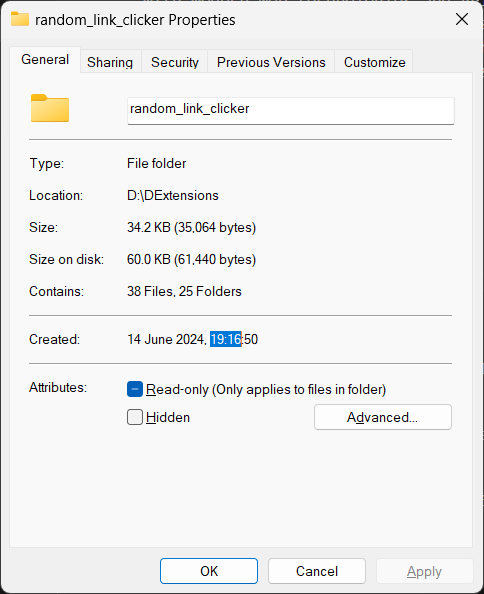
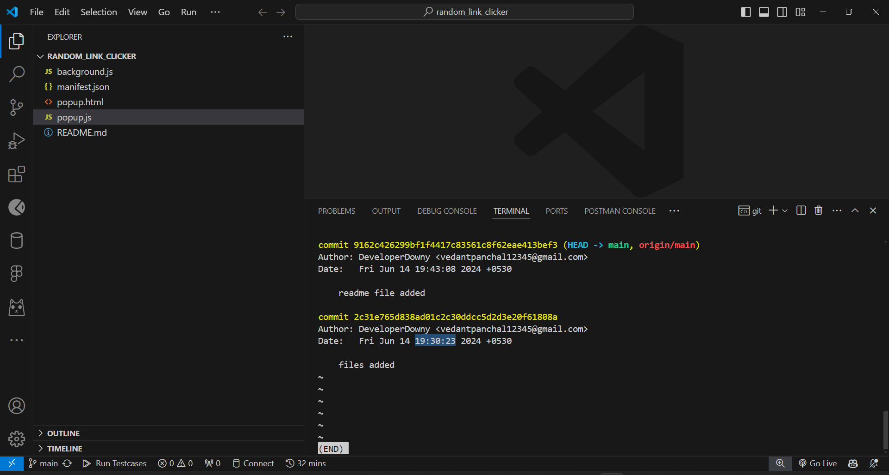

Project Title: Random GeeksforGeeks Problem Opener
==================================================

This project is a Google Chrome extension that helps you improve your problem-solving skills by randomly opening a problem from a list of problems on a GeeksforGeeks page.

Thus, reducing cognitive load produced when deciding what question to solve out of the list of suggested questions.

Description
-----------

The extension is built using JavaScript and Chrome's extension APIs. It works by extracting all the links from the currently active tab and filtering out the ones that lead to problem pages on GeeksforGeeks. If such links are found, it randomly selects one and opens it in a new tab.

The main function 


```javascript
async function openRandomLink() {
  const [tab] = await chrome.tabs.query({ active: true, currentWindow: true });
  const url = tab.url;

  // Extract all links using querySelectorAll
  const links = await chrome.scripting.executeScript({
    target: { tabId: tab.id },
    func: () =>
      Array.from(document.querySelectorAll("a[href]")).map((link) => link.href),
  });

  // Filter out empty URLs and the current page URL and only keep the links that start with "https://www.geeksforgeeks.org/problems/"
  const prefix = "https://www.geeksforgeeks.org/problems/";
  const filteredLinks = links[0].result.filter(
    (link) => link && link !== url && link.startsWith(prefix)
  );

  if (filteredLinks.length > 0) {
    const randomIndex = Math.floor(Math.random() * filteredLinks.length);
    const randomUrl = filteredLinks[randomIndex];
    await chrome.tabs.create({ url: randomUrl });
  } else {
    console.log("No links found on this page.");
  }
}

chrome.runtime.onMessage.addListener((message) => {
  if (message === "openRandomLink") {
    openRandomLink();
  }
});
```
 is responsible for this operation. It uses chrome.tabs.query to get the current active tab, chrome.scripting.executeScript to extract all the links from the page, and chrome.tabs.create to open a new tab with the selected problem.

Motivation
----------

The motivation behind this project was to create a tool that encourages continuous learning and problem-solving practice. By randomly selecting a problem, it eliminates the bias of problem selection based on perceived difficulty, ensuring a well-rounded skill development.

Future Improvements
-------------------

Future improvements could include options to filter problems based on difficulty level or topic, and the ability to track solved problems to avoid repetition.

About the Developer
-------------------

I am a passionate software developer with a keen interest in problem-solving and web development. This project showcases my ability to create practical tools and my understanding of Chrome's extension APIs. I am always eager to learn and apply new technologies. I believe in the power of coding to solve problems and make our lives easier.

Contact
-------


If you have any questions or suggestions, feel free to reach out to me via [vedantpanchal12345@gmail.com](mailto:vedantpanchal12345@gmail.com) or connect with me on LinkedIn. I am always open to feedback and collaboration.

[](https://www.linkedin.com/in/vedantpanchal)

This project is a testament to my ability to work with modern web technologies and APIs, and my passion for creating tools that enhance productivity and learning. I am confident that these qualities make me a strong candidate for any software development role.

Built this project in just 14 minutes
-------
Start Time: 19:16


End Time: 19:30
